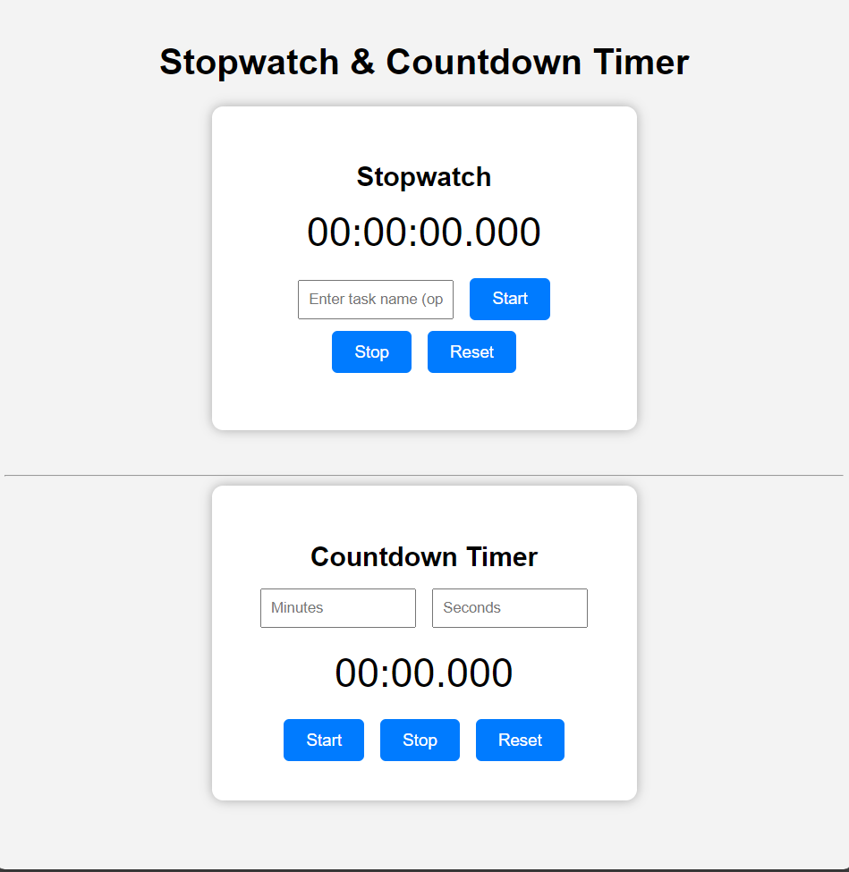

# Stopwatch & Countdown Timer (JS)

A simple **Stopwatch** and **Countdown Timer** web application built with **HTML, CSS, and JavaScript**.  
Includes milliseconds display, task name recording, and smooth countdown functionality.

## Features

### Stopwatch
 Displays hours, minutes, seconds, and milliseconds (`hh:mm:ss.mmm`)
 Start, Stop, and Reset functionality
 Optional task name input, displays task completion time on stop

### Countdown Timer
 Input minutes and seconds
 Displays countdown with milliseconds (`mm:ss.mmm`)
 Start, Stop, and Reset functionality
 Alerts when time is up
 Validates empty or zero inputs

### UI
 Clean and responsive design
 Buttons for control and input fields for task/time

## How to Use

1. **Open `index.html`** in a browser.
2. **Stopwatch**
    Enter a task name (optional)
    Click **Start** to begin
    Click **Stop** to stop and display task completion
    Click **Reset** to reset the stopwatch
3. **Countdown Timer**
    Enter **Minutes** and **Seconds**
    Click **Start** to begin countdown
    Click **Stop** to pause
    Click **Reset** to reset the timer

## Technologies Used
 **HTML5**
 **CSS3**
 **JavaScript (JS)**

## Screenshots 

## License
This project is **open source** and free to use for learning purposes.

---

## Author
**Samuditha Kavishka**

